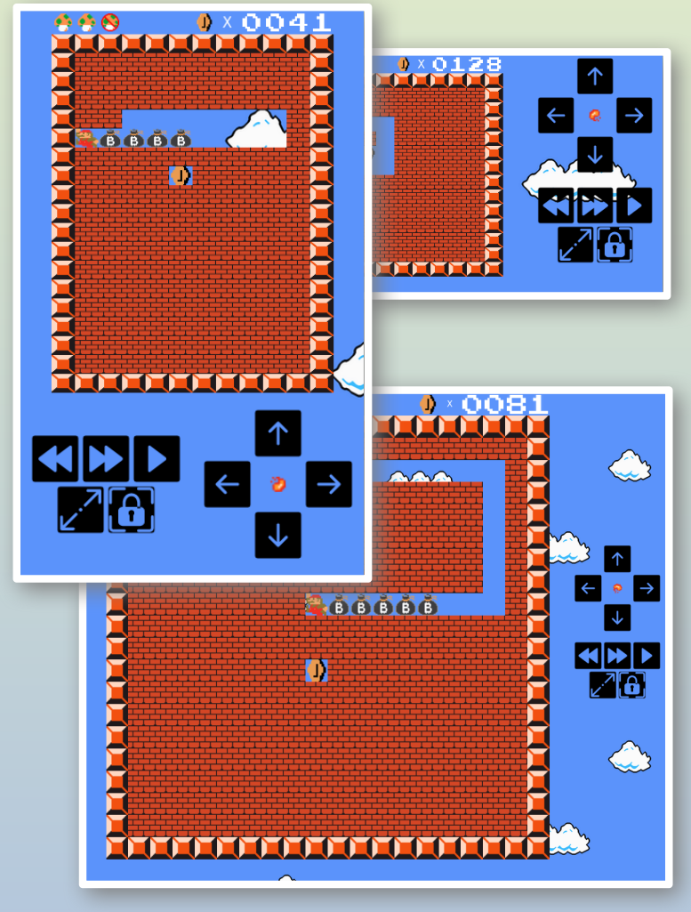

# Snake-Mario game

This is a practice project that implements a classic snake game with Mario graphics.

## Table of contents

- [Overview](#overview)
  - [Description](#description)
  - [Screenshot](#screenshot)
  - [Links](#links)
  - [Start](#start)
- [My process](#my-process)
  - [Built with](#built-with)
- [Author](#author)

## Overview

### Description

Game features:

- Game score is counted (20 per gold coin and 1 per internal-wall fragment eaten).
- Works on different screen resolutions.
- Board size changes depending on available screen size and screen rotation.
- Board size changes can be blocked by using an icon with a lock.
- Mario has 3 lives available
- After all internal-wall fragments are cleared the board reloads but points continue to count.
- There are no game levels. But it is possible to adjust the speed by using buttons.
- If allowed by the browser settings it can switch to a full screen mode (useful on mobile devices)
- Game controls on mobile/tablet:
  - use on-screen buttons
- Game controls on desktop:
  - keyboard arrows to turn
  - Esc to pause.
  - Enter to start

### Screenshot

Solution screenshot

### Links

- Live Site URL: [mario-snake.vercel.app](https://mario-snake.vercel.app/)

### Start

To start the project locally go tot the the project directory and run `npm start`
Open [http://localhost:3000](http://localhost:3000) to view it in the browser.

## My process

### Built with

- [React](https://reactjs.org/) - JS library
- [React Redux](https://redux.js.org/) - JS library
- [W3.CSS](https://www.w3schools.com/w3css/) - a "smaller, faster and easier to use" alternative to Bootstrap.

## Author

- Website - [linkedin](https://www.linkedin.com/in/artur-jedrzejczak/)
- Profile - [profile website](https://artur-jedrzejczak.vercel.app/)
